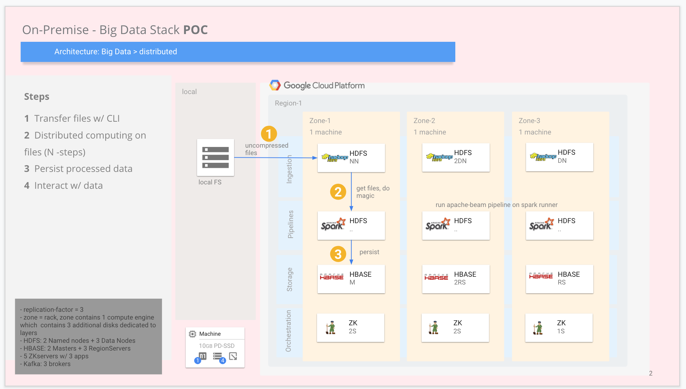

# hadoop-sandbox

Fully Distributed installation of hadoop ecosystem on GCP IaaS.

- [x] Apache Hadoop (hdfs): java8
- [ ] Apache Hadoop (yarn, mapreduce)
- [ ] Apache Zookeeper: java8
- [ ] Apache Hbase: java8, hdfs, Zookeeper
- [ ] Apache Spark: java8, Zookeeper ???
- [ ] Apache Kafka: java8, Zookeeper

## High Level Architecture - POC
   

### How to Start

Create a GCP account and billing account etc..., Then

 on Local 

1. Configure your _local_ for gcloud CLI or use _gshell_, after cloning the git-reporitory.
    - for local, run `gcloud auth list` to check active gcp account. And `gcloud auth login` if necessary
2. `git clone https://github.com/tansudasli/hadoop-sandbox.git`, then `cd hadoop-sandbox` folder
3. Run `./preparations.sh` to create project, and to link billing account on GCP
4. Run `./create-machines.sh` to create machines w/ `cloud-init.yaml` file on GCP

 on allMachines 

5. ssh to instances on GCP, then `sudo -u hadoop -i` to switch to hadoop user, then `cd hadoop-sandbox` folder
    - run `./checks.sh` to check results of step 4, then
    - run `./ssh-passwordless.sh` to create public keys, and _.ssh_ folder for all machines.
        - then in nameNode, copy .ssh/id_rsa.pub content into clipboard, and 
        - ssh to machine-2 *manually* and _add_ this into `nano .ssh/authorized_keys` content
        - then conect w/ `ssh hadoop@machine-2` from machine-1 to machine-2 and w/ `ssh hadoop@machine-3` to machine-3

 After this, machine-1 (which has nameNode) can ssh to machine-2 and machine-3 without password!

 on nameNode 

6. run `./configure-hadoop.sh` to configure _HDFS_ in distributed mode. 
    - Distributes conf files to other workers automatically
    - Formats HDFS for first time usage

 on Local 

7. Check `http://machine-1-IP:9870`
    - or, `$HADOOP_HOME/logs`
    - or, `jps` to see java apps (namenode, secondarynamenode, datanode)
    - or, `netstat -a -t --numeric-ports -p` for binding exceptions
    - or, `sudo ss -atpu` sshd listening and connected status

#### About Possible Errors

- to create and delete machine-x many times, you may need to clean `rm -r .ssh/` on your local *to eliminate ssh connection problems*

#### More about production-readiness 

- [x] More optimized and parametric scripts (env files etc.)
- [ ] Use less static-IPs (just for masters etc.)
- [ ] Dynamic machine-Types regarding to purposes (diff. CPU and RAM configs)
- [ ] Dynamic port management (open for only masters)
- [x] Nodes should be dedicated to hdfs, hbase, spark etc... So it becomes *fully distributed*
- [ ] JVM optimizations
- [x] Better disk architecture (local ssd disks etc.)
- [ ] Backups to network attached disks
- [ ] More hadoop security (kerberos etc.)
- [ ] More network layer security (diff. subnets etc.)

and consider _free_ cloudera distribution, for better hadoop management