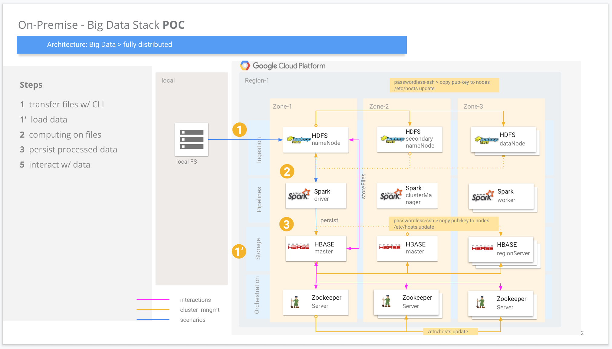

# hadoop-sandbox

Distributed installation of hadoop ecosystem on GCP IaaS.

- [ ] Apache Hadoop (hdfs only)
    - requires java8
- [ ] Apache Hbase 
    - requires java8, hdfs, Zookeeper
- [ ] Apache Zookeeper (central)
    - requires java8
- [ ] Apache Kafka
    - requires java8, Zookeeper

## High Level Architecture - POC
   

### How to Start

Create a GCP account and billing account etc..., Then

 on Local 

1. Configure your _local_ for gcloud CLI or use _gshell_, after cloning the git-reporitory.
    - for local, run `gcloud auth list` to check active gcp account. And `gcloud auth login` if necessary
2. `git clone https://github.com/tansudasli/hadoop-sandbox.git`, then `cd hadoop-sandbox` folder
3. Run `./preparations.sh` to create project, and to link billing account on GCP
4. Run `./create-machines.sh` to create machines w/ `cloud-init.yaml` file on GCP

 on allMachines 

5. ssh to instances on GCP, then `sudo -u hadoop -i` to switch to hadoop user, then `cd hadoop-sandbox` folder
    - run `./checks.sh` to check results of step 4, then
    - run `./ssh-passwordless.sh` to create public keys, .ssh folder for all machines.
        - then in nameNode, copy .ssh/id_rsa.pub content into clipboard, and 
        - ssh to machine-2 manually and add this into .ssh/authorized_keys content
        - then conect w/ `ssh hadoop@machine-2` from machine-1 to machine-2
        - do this to all machines where necessary

 on nameNode 

6. run `./configure-hadoop.sh` on nameNode to configure HDFS in distributed mode, then distributes conf files to other workers

 on Local 

7. Check `http://IP:9870`
    - or, `$HADOOP_HOME/logs`
    - or, `jps` to see java apps (namenode, secondarynamenode, datanode)
